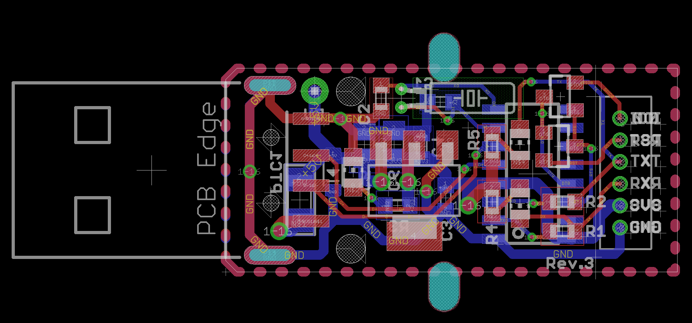
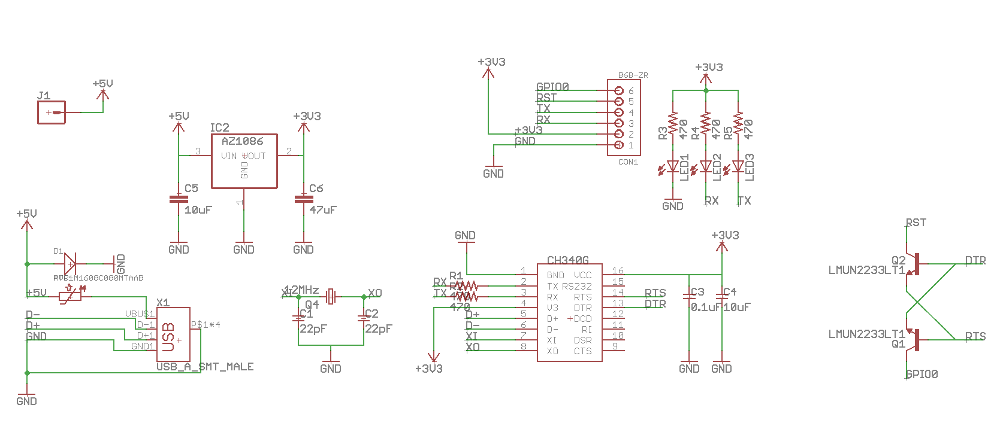
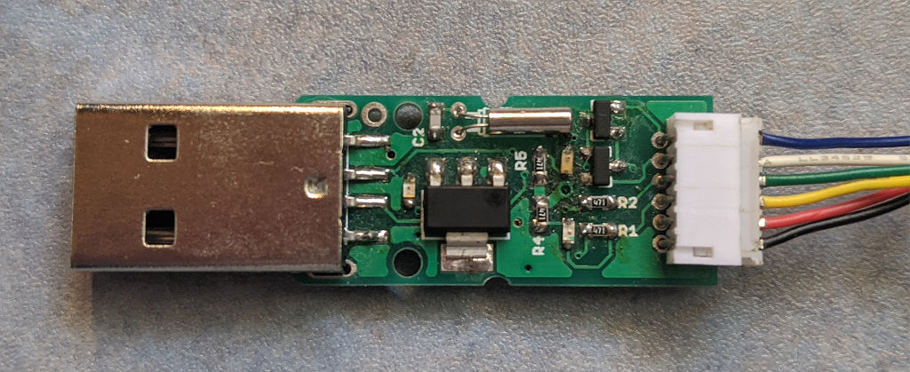
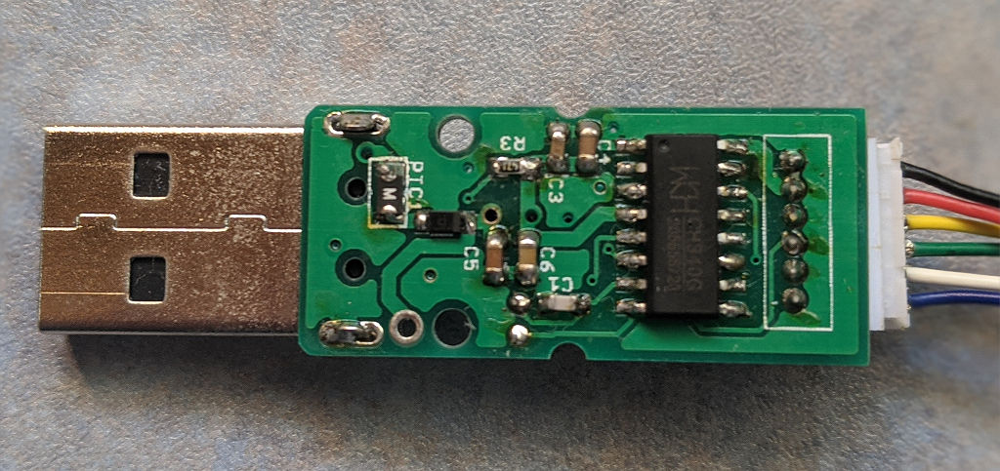
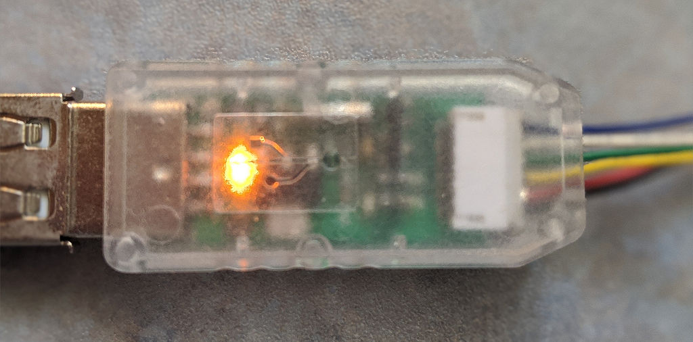

# USB-Serial converter for ESP8266 auto program

DTR, RTS を利用して ESP8266(ESP-WROOM-02) のリセットを制御。Arduino での書き込みを自動化する。

はんだごてでハンダづけでき、わりかしコンパクトなフットプリント。

3.3V 専用。

`J1` ピンはショットキーバリアダイオードを通る分、5V から電圧降下(0.3～0.4V)します。

# ボード

# 回路図

# 部品表

| 部品番号       | 値                 | 部品名                                      | 入手先   | 備考                                                             |
| -------------- | ------------------ | ------------------------------------------- | -------- | ---------------------------------------------------------------- |
| D1             | 30V1A              | ショットキーバリアダイオード RSX101VAM-30TR | 秋月電子 | [I-05951](http://akizukidenshi.com/catalog/g/gI-05951/)          |
| PTC1           | 0.75A6V(2012)      | リセッタブルフューズ PICOSMDC075S-2         | eBay     | https://www.ebay.com/itm/263051781459                            |
| X1             |                    | USBコネクタ(A/オス) UAM-21BK                | aitendo  | http://www.aitendo.com/product/16665                             |
| C1/C2          | 22pF50V(1608)      | 積セラコンデンサ                            | aitendo  | http://www.aitendo.com/product/6989                              |
| Q4             | 12MHz              | クリスタル（2x6）                           | aitendo  | http://www.aitendo.com/product/5028                              |
| C3             | 0.1uF50V(1608)     | 積セラコンデンサ GRM188F11H104ZA01          | 秋月電子 | [P-13374](http://akizukidenshi.com/catalog/g/gP-13374/)          |
| C4/C5          | 10uF25V(2012)      | 積セラコンデンサ GRM21BB31E106KA            | 秋月電子 | [P-13388](http://akizukidenshi.com/catalog/g/gP-13388/)          |
| IC1            |                    | USB-シリアルコンバータ CH340G               | aitendo  | http://www.aitendo.com/product/11576                             |
| C6             | 22uF25V(1608)            | 積セラコンデンサ GRM21BR61E226ME44          | 秋月電子 | [P-08240](http://akizukidenshi.com/catalog/g/gP-08240/) 47uF がいいかも [mouser](https://www.mouser.jp/Passive-Components/Capacitors/Ceramic-Capacitors/MLCCs-Multilayer-Ceramic-Capacitors/Multilayer-Ceramic-Capacitors-MLCC-SMD-SMT/_/N-bkrdv?P=1z0wrk9Z1yx4avtZ1yzmou5)        |
| IC2            | 3.3V               | レギュレータ AMS1117-3.3 や AZ1086H-3.3     | 秋月電子 | [I-02502](http://akizukidenshi.com/catalog/g/gI-02502/)          |
| R1/R2/R3/R4/R5 | 470Ω(1608)         | チップ抵抗                                  | 千石電商 | https://www.sengoku.co.jp/mod/sgk_cart/detail.php?code=EEHD-57GC |
| LED1           | VF=1.9～2.1V(1608) | オレンジ色チップLED                         | 秋月電子 | [I-06416](http://akizukidenshi.com/catalog/g/gI-06416/)          |
| LED2           | VF=1.9～2.1V(1608) | 黄緑色チップLED                             | 秋月電子 | [I-03980](http://akizukidenshi.com/catalog/g/gI-03980)           |
| LED3           | VF=1.9～2.1V(1608) | 赤色チップLED                               | 秋月電子 | [I-03978](http://akizukidenshi.com/catalog/g/gI-03978)           |
| CON1           | ZHコネクタ6ピン    | S6B-ZR                                      | 秋月電子 | [C-14164](http://akizukidenshi.com/catalog/g/gC-14164/) ワイヤ直付けでもよいと思います         |
| Q1/Q2          |                    | LMUN2233LT1G                                | eBay     | https://www.ebay.com/itm/262770111020                            |
|                | E40X18.5X9.6B      | USBプラケース                               | aitendo  | http://www.aitendo.com/product/16537                             |

# できあがり

## 表面

## 裏面

## ケースに入れて接続した状態

